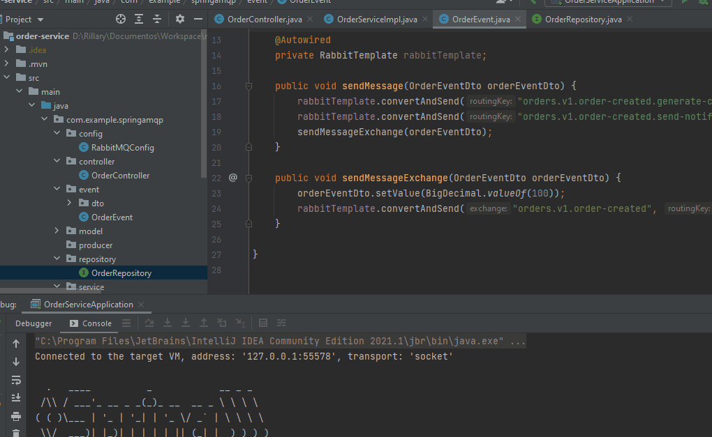

<h1 style="text-align: center; font-weight: bold;">RabbitMQ com Spring AMQP</h1>

<p align="center">
  

  

  
  
  <a href="https://github.com/leandro-barros/rabbitmq-springAMQP/commits/master">
    
  </a>

  <a href="https://github.com/leandro-barros/rabbitmq-springAMQP/issues">
    
  </a>

  <!-- -->
  
</p>

<h4 align="center"> 
	🚧  RabbitMQ com Spring AMQP ♻️ Concluído 🚀 🚧
</h4>

<p align="center">
 <a href="#-sobre-o-projeto">Sobre o Projeto</a> •
 <a href="#-executar-o-projeto">Executar Projeto</a> • 
 <a href="#-tecnologias">Tecnologias</a> • 
 <a href="#-autor">Autor</a> • 
 <a href="#-licença">Licença</a>
</p>


<p align="center">
  
</p>

## 💻 Sobre o projeto

Criação de três microserviços que são: Pedido, notificação e Cash Back. 
Esses projetos com arquitetura de microserviços permitiu praticar a implementação de comunicação assíncrona entre APIs REST através da mensageria RabbitMQ.

O serviço de Pedido dispara eventos produzindo mensagens para que os serviços de notificação e Cashback ouvem e consomem as mensagens.

As mensagens foram enviadas utilizando Exchange e também com comunicação direta entre filas.

O RabbitMQ e o MySQL foram instalados utilizando o Docker.

## 🚀 Executar o projeto

Este projeto é uma API RESTful desenvolvida com Spring Boot, possuindo endpoints expostos para efetuar requisições.

### Pré-requisitos

Para executar o projeto precisa ter instalado em sua máquina as seguintes ferramentas:
[Git](https://git-scm.com), [Java](https://aws.amazon.com/pt/corretto/?filtered-posts.sort-by=item.additionalFields.createdDate&filtered-posts.sort-order=desc), [Docker](https://docs.docker.com/desktop/install/windows-install/) e [Postman](https://www.postman.com/). 
Além disto é bom ter um editor para trabalhar com o código como [Intellij](https://www.jetbrains.com/pt-br/idea/).

O Postman é para executar as requisições.

#### 🧭 Rodando a API REST

```bash
# Clone este repositório
$ git clone <https://github.com/leandro-barros/rabbitmq-springAMQP.git>

# Execute o contâiner Docker com Docker Compose
$ docker-compose up

# Na classe principal execute o projeto.

# O servidor inciará na porta:
  $ 8080 para OrderService
  $ 8081 para o CashBachService
  $ 8082 para o NotificationService
```

## 🛠 Tecnologias

As seguintes ferramentas foram utilizadas na construção do projeto:

- [Java 11](https://aws.amazon.com/pt/corretto/?filtered-posts.sort-by=item.additionalFields.createdDate&filtered-posts.sort-order=desc)
- [RabbitMQ](https://www.rabbitmq.com/#getstarted)
- [Spring Boot](https://spring.io/projects/spring-boot)
- [Spring MVC](https://docs.spring.io/spring-framework/docs/current/reference/html/web.html)
- [Spring Data JPA](https://spring.io/projects/spring-data-jpa)
- [Spring AMQP](https://spring.io/projects/spring-amqp)
- [MySQL](https://www.mysql.com/downloads/)
- [Maven](https://maven.apache.org/)
- [Docker](https://docs.docker.com/get-docker/)
- [Docker Compose](https://docs.docker.com/compose/)

## 👨‍💻 Autor

<a href="https://www.linkedin.com/in/leandroebarros/">
   
  <br />
  <sub><b>Leandro Barros</b></sub></a> <a href="https://www.linkedin.com/in/leandroebarros/" title="leandro">🚀
</a>

[](https://www.linkedin.com/in/leandroebarros/) 
[](leandroedbarros@gmail.com)

## 📝 Licença

Projeto esta sobe a licença [MIT](./LICENSE).

By Leandro Barros ❤️  [Entre em contato!](https://www.linkedin.com/in/leandroebarros/)
